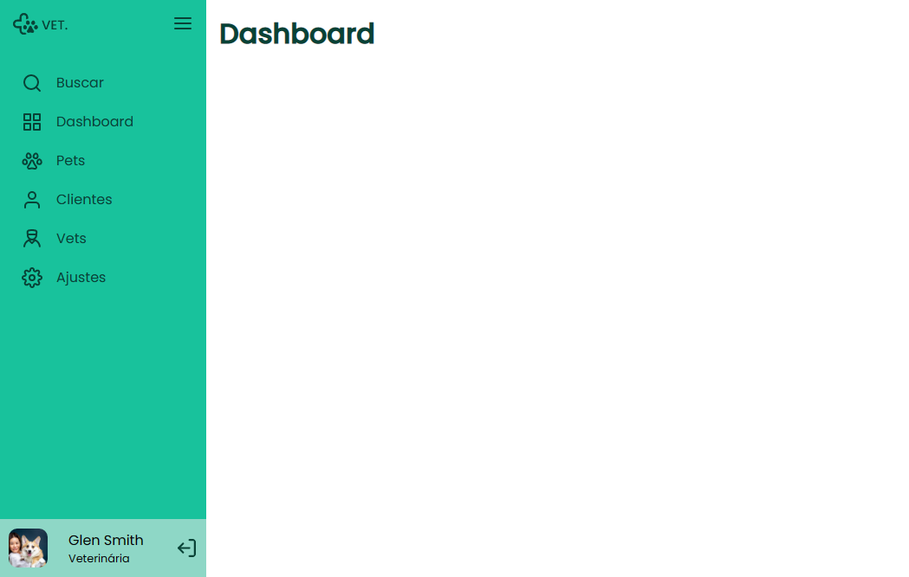

<h1 align="center"> Desafio Sidebar by Rocketseat</h1>

Neste desafio você deve criar uma sidebar. Quando o usuário clicar no ícone do menu isso deve fazer com que o estado da sidebar mude entre "aberto", mostrando ícones e texto e "fechado", mostrando apenas os ícones.

  <a href="#-tecnologias">Tecnologias</a>&nbsp;&nbsp;&nbsp;|&nbsp;&nbsp;&nbsp;
  <a href="#-projeto">Projeto</a>&nbsp;&nbsp;&nbsp;|&nbsp;&nbsp;&nbsp;
  <a href="#-layout">Layout</a>&nbsp;&nbsp;&nbsp;|&nbsp;&nbsp;&nbsp;
  <a href="#memo-licença">Licença</a>

  

 

  

## 🚀 Tecnologias

Esse projeto foi desenvolvido com as seguintes tecnologias:

- HTML e CSS
- JavaScript
- Git & Github

## 💻 Projeto

Uma característica principal desta página web é uma barra lateral que se abre e fecha quando o ícone do menu hambúrguer é clicado. Dê uma olhada no projeto [aqui](https://matheusfdosan.github.io/desafio-sidebar-rocketseat/).

## 🔖 Layout

Você pode visualizar o layout do projeto através [DESSE LINK](https://www.figma.com/file/iOuqAlZvhAMkkfjCMFyc7Y/DD-%2F-Sidebar-Responsiva/duplicate).

## :memo: Licença

Esse projeto está sob a licença MIT.

---

Feito com ♥ by Rocketseat :wave: [Participe da nossa comunidade!](https://discord.gg/rocketseat)
